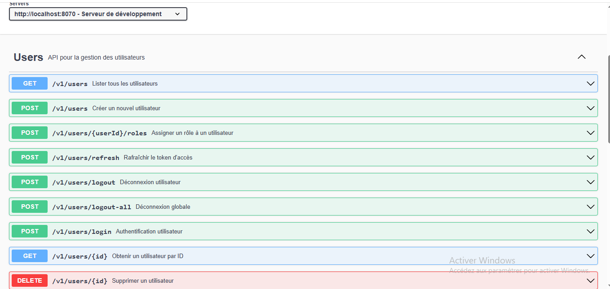
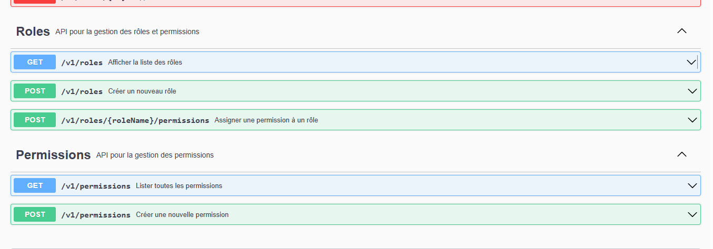

# Projet_microservice_security

Microservice Security est une application Spring Boot qui gère les utilisateurs, 
les rôles, les permissions et l'authentification JWT (access token + refresh token). 
Elle est conçue pour être utilisée comme **microservice d'authentification** dans un projet plus large.

---

## 📌 Objectif

- Gérer les utilisateurs (CRUD)
- Assigner des rôles aux utilisateurs
- Assigner des permissions aux rôles
- Authentification avec JWT (access + refresh tokens)
- Démonstration via Swagger UI

---

## 🛠️ Outils utilisés

- Java 17
- Spring Boot
- Spring Security
- Hibernate / JPA
- MySQL
- Maven
- Swagger (OpenAPI)
- Lombok

---

## ⚙️ Installation et configuration

### 1. Cloner le projet
```bash
git clone https://github.com/SalwaElghailani1/Projet_MicroService-microservice_security.git
cd microservice_security
```
### 2. Démarrer MySQL


### 3. Lancer l'application
```bash
mvn spring-boot:run
```
### 4. Base de Données Initiale
La classe DataInitializer crée automatiquement :
- Rôles : ADMIN
- Permissions : CREATE, READ, UPDATE, DELETE
- Utilisateur admin par défaut :
   - Email: admin@example.com
   - Mot de passe: admin123
   - Rôle: ADMIN avec toutes les permissions
Pour ajouter plusieurs rôles à ta table roles dans la base de données
  ```sql
     INSERT INTO roles (name, description) VALUES
     ('CLIENT', 'Rôle par défaut pour les utilisateurs clients')
     ('HOUSEKEEPING', 'Maintenir les chambres propres, disponibles et prêtes à l’usage.'),
     ('RECEPTIONNISTE', 'Assurer la gestion quotidienne des clients et des réservations au niveau de la réception.'),
     ('MANAGER', 'Superviser l’ensemble des activités de l’hôtel et assurer la prise de décision stratégique.'),
     ('MAINTENANCE', 'Assurer le bon fonctionnement technique des chambres et des installations de l’hôtel.'),
     ('COMPTABLE', 'Rôle Gérer les aspects financiers et comptables de l’hôtel');
  ```
## Page d'Accueil Swagger



## Points Forts du Microservice
- ✅ Sécurité renforcée : JWT avec tokens d'accès et de rafraîchissement
- ✅ Gestion fine des permissions : Contrôle d'accès basé sur les rôles
- ✅ Documentation automatique : Swagger intégré
- ✅ Facile à intégrer : API REST standard
- ✅ Base de données pré-configurée : Utilisateur admin créé automatiquement
## Tests
  Pour tester le microservice :
  - Accédez à Swagger : http://localhost:8070/swagger-ui/index.html
  - Authentifiez-vous avec admin@example.com/admin123 
  - Copiez le token JWT 
  - Cliquez sur "Authorize" en haut et collez Bearer <votre-token>
  - Testez tous les endpoints sécurisés
## Conclusion
Ce microservice fournit une solution complète pour :
- ✅ Authentification JWT
- ✅ Gestion des utilisateurs
- ✅ Contrôle d'accès basé sur les rôles et les permissions
- ✅ Documentation interactive avec Swagger
- ✅ Configuration facile et prête à l'emploi

L'utilisateur admin créé automatiquement permet de tester immédiatement toutes les fonctionnalités sans configuration manuelle supplémentaire.